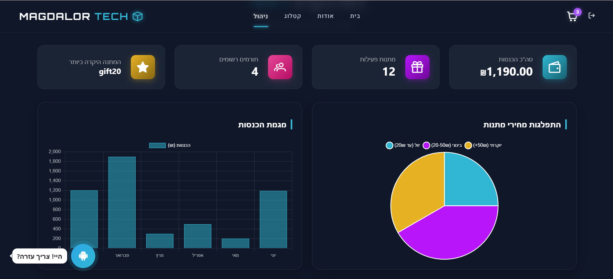
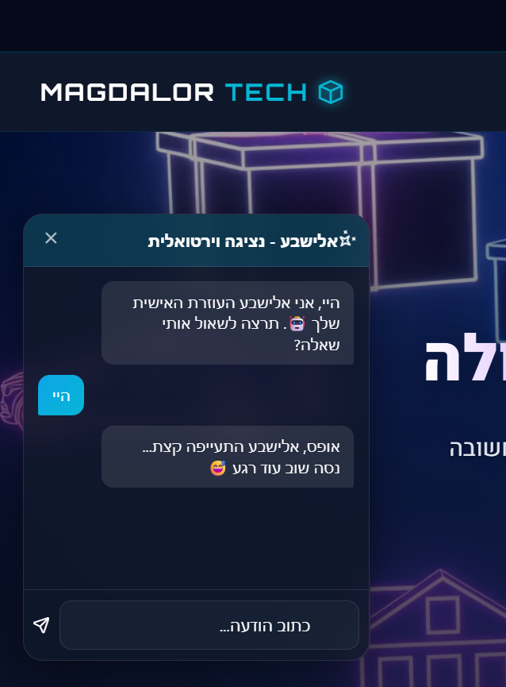

# MagdalorTech

[](https://dotnet.microsoft.com/)
[](https://angular.dev/)
[](https://www.typescriptlang.org/)
[](https://www.microsoft.com/sql-server)
[](https://learn.microsoft.com/ef/core/)
[](https://rxjs.dev/)

## סקירה כללית

זהו פרויקט לניהול מכירה סינית בשם **MagdalorTech**. המערכת כוללת ממשק Web ציבורי ושרת ASP.NET Core המספק `REST API`.

המערכת תומכת בהרשמה והתחברות משתמשים, קטלוג מתנות, ניהול תורמים ומתנות, סל קניות, הזמנות, הגרלות, זיהוי זוכים, אזור ניהול, העלאת תמונות ושירות AI אופציונלי.

זהו פרויקט לימודי שנבנה לצורך תרגול פיתוח מצד הלקוח ומצד השרת, עבודה עם `REST API`, ניהול מסד נתונים, Authentication והרשאות.

הפרויקט מאורגן במבנה **Monorepo** הכולל שני יישומים עצמאיים:

- אפליקציית הלקוח נמצאת בתיקייה `client` ומבוססת על Angular.
- אפליקציית השרת נמצאת בתיקייה `server` ומבוססת על ASP.NET Core Web API.

## טכנולוגיות

### צד הלקוח

- גרסת Angular של הלקוח היא `20.3.x`, בהתאם ל-`client/package.json`.
  - גרסת הליבה `@angular/core` היא `^20.3.0`.
  - גרסת Angular CLI היא `^20.3.8`.
- שפת הפיתוח בצד הלקוח היא `TypeScript`.
- ניהול זרמי המידע מתבצע באמצעות `RxJS`.
- מבנה האפליקציה מבוסס על `Angular Standalone Components`.
- רכיבי הממשק מבוססים על `PrimeNG` ועל `PrimeIcons`.
- הגרפים מוצגים באמצעות `Chart.js`.
- עיצוב הממשק נכתב באמצעות `SCSS`.
- בדיקות הלקוח מבוססות על `Jasmine` ועל `Karma`.

### צד השרת

- השרת מבוסס על `ASP.NET Core Web API` ועל `.NET 8`.
- הגישה למסד הנתונים מתבצעת באמצעות `Entity Framework Core`.
- מסד הנתונים הוא `SQL Server`.
- האימות מתבצע באמצעות `JWT Bearer Authentication`.
- הרשאות התפקידים מבוססות על `Role-Based Authorization`.
- המיפוי בין המודלים מתבצע באמצעות `AutoMapper`.
- רישום האירועים מתבצע באמצעות `Serilog`.
- תיעוד ה-API מתבצע באמצעות `Swagger / OpenAPI`.
- השרת כולל `Middleware` מותאם אישית.
- שירות ה-AI מבוסס על `OpenAI-compatible API`.

### מסד נתונים ו-Assets

- מסד הנתונים הוא SQL Server.
- יצירת הסכמה מנוהלת באמצעות EF Core Migrations.
- תמונות מתנות נשמרות תחת `server/ChineseAuction.Api/wwwroot/images/gifts`.
- הלקוח כולל תמונות, סרטונים ו-assets נוספים תחת `client/public`.

בסביבת פיתוח, הלקוח פונה לשרת בכתובת `https://localhost:7006` ושולח JWT באמצעות `HTTP Interceptor`. השרת מאפשר `CORS` עבור `http://localhost:4200`.

## מבנה הפרויקט

```text
MagdalorTech/
|-- client/
|   |-- public/                       # images, videos, favicon
|   |-- src/app/components/
|   |   |-- auth/                     # Login and Register
|   |   |-- cart/                     # Cart and Checkout
|   |   |-- chat-widget/              # AI assistant UI
|   |   |-- gift/                     # Gift catalog and forms
|   |   |-- layout/                   # Shared Header
|   |   |-- manager/                  # Management views
|   |-- src/app/pages/                # Home and About
|   |-- src/app/services/             # API services, Guard, Interceptor, Cart state
|   |-- src/app/models/               # Client-side models
|   |-- angular.json
|   |-- package.json
|   `-- package-lock.json
|-- server/
|   |-- ChineseAuction.Api/
|   |   |-- Controllers/              # Auth, Users, Gifts, Donors, Categories, Orders, Lottery, AI
|   |   |-- Data/                     # AppDbContext
|   |   |-- Dtos/                     # Request and response contracts
|   |   |-- Mappings/                 # AutoMapper Profiles
|   |   |-- Middleware/               # Exceptions, Logging, Rate Limiting, Purchaser
|   |   |-- Migrations/               # EF Core schema history
|   |   |-- Models/                   # User, Gift, Donor, Category, Order, Winner
|   |   |-- Repositories/             # Data access layer
|   |   |-- Services/                 # Business logic, JWT, files, AI
|   |   |-- wwwroot/images/gifts/      # Uploaded gift images
|   |   |-- appsettings.json
|   |   `-- ChineseAuction.Api.csproj
|   |-- ChineseAuction.Api.sln
|   `-- .gitignore
|-- .gitignore
|-- screenshots/                     # Project screenshots
`-- README.md
```

## יכולות עיקריות

### משתמשים ולקוחות

- המשתמשים יכולים להירשם ולהתחבר באמצעות `JWT`.
- המערכת שומרת את מצב המשתמש בצד הלקוח.
- ניתן לצפות בקטלוג המתנות.
- ניתן למיין מתנות לפי מחיר ולפי קטגוריה.
- ניתן לחפש מתנות ולהציג את פרטיהן.
- ניתן לנהל את סל הקניות.
- ניתן לבצע `Checkout` ולאשר הזמנה.
- ניתן להסיר פריטים מההזמנה.
- המערכת מציגה מידע על זוכים ותוצאות הגרלה.
- המערכת כוללת את עמודי `Home` ו-`About`.
- המערכת כוללת `Chat Widget` אופציונלי המחובר לשרת AI.

### מנהלים

- אזור הניהול מוגן באמצעות Angular `adminGuard` והרשאות בצד השרת.
- המנהלים יכולים לבצע פעולות `CRUD` על מתנות.
- ניתן לשייך מתנות לתורמים.
- ניתן להעלות תמונות באמצעות `Multipart Form Data`.
- המנהלים יכולים לבצע פעולות `CRUD` על תורמים.
- ניתן לחפש תורמים לפי שם או לפי `Email`.
- ניתן לנהל קטגוריות.
- ניתן לנהל משתמשים.
- ניתן לבצע הגרלה למתנה יחידה או לכל המתנות.
- ניתן לצפות בהזמנות מאושרות ובהזמנות לפי מתנה.
- ניתן להפיק דוח זוכים בפורמט `CSV`.

### תשתית השרת

- הפרדה בין `Repositories` לבין `Services`.
- השרת משתמש ב-`Dependency Injection`.
- שמירת הנתונים מתבצעת באמצעות `EF Core` עם SQL Server ו-`Migrations`.
- השרת מבצע אימות `JWT` הכולל `Issuer`, `Audience`, `Key` ו-`Expiry`.
- הרשאות המנהלים מנוהלות באמצעות `Role-Based Authorization`.
- תיעוד ה-API זמין באמצעות `Swagger UI` בסביבת `Development`.
- המערכת מונעת `JSON reference cycles`.
- השרת משתמש ב-`HTTPS Redirection` וב-`Static Files`.
- רישום האירועים מתבצע באמצעות `Serilog Logging`.
- השרת כולל `Exception Middleware`, `Request Logging Middleware` ו-`Rate Limiting Middleware`.

## דרישות מקדימות

יש להתקין מראש:

- נדרש `Git`.
- נדרש `.NET 8 SDK`.
- נדרשים `Node.js` ו-`npm` התואמים ל-Angular 20.3.
- נדרש SQL Server או SQL Server Express.
- ניתן להגדיר `OpenAI-compatible API key` עבור שירות ה-AI.

## התקנה והרצה מקומית

### 1. שכפול הפרויקט

```powershell
git clone https://github.com/ch8505/MagdalorTech.git
cd MagdalorTech
```

### 2. הגדרת השרת

יש ליצור קובץ `appsettings.Development.json` תחת `server/ChineseAuction.Api` או לעדכן את הגדרות הפיתוח המקומיות:

```json
{
  "ConnectionStrings": {
    "DefaultConnection": "Server=localhost;Database=ChineseAuctionDB;Trusted_Connection=True;TrustServerCertificate=True;"
  },
  "Jwt": {
    "Key": "replace-with-a-long-development-secret",
    "Issuer": "ChineseAuction",
    "Audience": "ChineseAuctionClients",
    "ExpiryMinutes": 60
  },
  "OpenAi": {
    "ApiKey": "replace-if-ai-chat-is-enabled",
    "Model": "gpt-4o-mini"
  }
}
```

אין להעלות ל-Git סיסמאות, Database credentials, JWT signing keys או API keys אמיתיים.

להפעלת השרת:

```powershell
cd server
dotnet restore .\ChineseAuction.Api.sln
dotnet ef database update --project .\ChineseAuction.Api\ChineseAuction.Api.csproj
dotnet run --project .\ChineseAuction.Api\ChineseAuction.Api.csproj --launch-profile https
```

כתובות השרת הזמינות הן:

- כתובת `HTTPS`: `https://localhost:7006`.
- כתובת `HTTP`: `http://localhost:5204`.
- ממשק `Swagger`: `https://localhost:7006/swagger`.

אם תעודת ה-HTTPS המקומית אינה מאושרת:

```powershell
dotnet dev-certs https --trust
```

### 3. התקנת והרצת הלקוח

```powershell
cd client
npm ci
npm start
```

הלקוח יעלה בכתובת `http://localhost:4200`.

כיום כתובות ה-API מוגדרות ישירות בתוך שירותי Angular ומשתמשות ב-`https://localhost:7006`. בסביבת Deployment מומלץ להעביר אותן ל-Angular Environment Configuration.

### 4. בנייה ובדיקות

```powershell
# From client/
npm run build
npm test

# From the repository root
dotnet build .\server\ChineseAuction.Api.sln
```

ה-Production budgets של Angular הותאמו לגודל הנוכחי של היישום. מומלץ לבדוק את תוצאות `npm audit` לפני שימוש ב-Production.

## צילומי מסך

### דף הבית


### קטלוג המתנות


### לוח הבקרה למנהל



### צ'אט AI



## נקודות קצה של ה-API

כל הנתיבים מתחילים בקידומת `/api`. שמות הנתיבים בטבלה תואמים ל-Controller Attributes בפועל, כולל הנתיב הישן `Admine`.

| תחום | Method | Route | הרשאה | תיאור |
|---|---|---|---|---|
| Auth | POST | `/Auth/login` | Public | התחברות והנפקת JWT |
| Auth | POST | `/Auth/register` | Public | הרשמת משתמש |
| Auth | POST | `/Auth/logout` | Authenticated | התנתקות משתמש |
| Categories | GET/POST/PUT/DELETE | `/Category`, `/Category/{id}` | Admin | ניהול קטגוריות |
| Donors | GET/POST/PUT/DELETE | `/Donor`, `/Donor/{id}` | Admin | ניהול תורמים |
| Donors | GET | `/Donor/search/name` | Admin | חיפוש תורמים לפי שם |
| Donors | GET | `/Donor/search/email` | Admin | חיפוש תורמים לפי Email |
| Gifts | GET | `/Gift`, `/Gift/{id}` | Public | קטלוג ופרטי מתנה |
| Gifts | GET | `/Gift/sort-by-price` | Public | מיון מתנות לפי מחיר |
| Gifts | GET | `/Gift/sort-by-category` | Public | מיון מתנות לפי קטגוריה |
| Gifts | GET | `/Gift/search` | Public | חיפוש מתנות |
| Gifts | GET | `/Gift/admin` | Admin | רשימת מתנות לניהול |
| Gifts | POST | `/Gift/admin/add-to-donor/{donorId}` | Admin | הוספת מתנה לתורם |
| Gifts | PUT | `/Gift/{id}` | Admin | עדכון מתנה |
| Gifts | DELETE | `/Gift/{id}` | Admin | מחיקת מתנה |
| Gifts | POST | `/Gift/admin/add-image` | Admin | העלאת תמונת מתנה |
| Lottery | POST | `/Lottery/draw/{giftId}` | Admin | הגרלה עבור מתנה יחידה |
| Lottery | POST | `/Lottery/draw-all` | Admin | הגרלה עבור כל המתנות |
| Orders | GET | `/Orders/my-cart` | Controller-defined | הצגת סל/הזמנה נוכחית |
| Orders | POST | `/Orders` | Controller-defined | יצירת סל או הזמנה |
| Orders | PUT | `/Orders/{id}/confirm` | Controller-defined | אישור הזמנה |
| Orders | DELETE | `/Orders/{id}` | Controller-defined | מחיקת הזמנה |
| Orders | DELETE | `/Orders/{orderId}/items/{orderItemId}` | Controller-defined | הסרת פריט מהזמנה |
| Orders | GET | `/Orders/Admine` | Admin | הצגת הזמנות מאושרות |
| Orders | GET | `/Orders/Admine/by-gifts` | Admin | הצגת הזמנות לפי מתנות |
| Orders | GET | `/Orders/Admine/by-gifts-id` | Controller-defined | הצגת הזמנות לפי Gift IDs |
| Users | GET | `/Users/Admine` | Admin | רשימת משתמשים |
| Users | GET | `/Users/{id}` | Authenticated | הצגת משתמש לפי ID |
| Users | POST | `/Users` | Server-supported | יצירת משתמש |
| AI | POST | `/Ai/ask` | Controller-defined | שליחת שאלה לשירות AI |

Swagger הוא המקור הקובע עבור שדות ה-DTO, מבני `Request/Response` ופרטי `Multipart Upload`.
